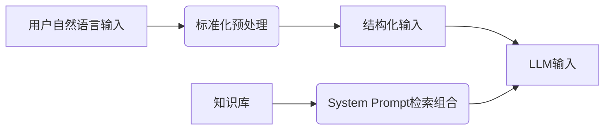

# 输入处理与Prompt生成流程

## 一、处理流程区分


## 二、标准化预处理模块
1. **功能**：
   - 自然语言纠错
   - 术语标准化映射
   - 模糊表达澄清

2. **示例**：
   ```python
   def preprocess_input(raw_text):
       # 术语标准化
       text = replace_terms(raw_text)  
       # 模糊检测
       if detect_ambiguity(text):
           return generate_clarification(text)
       return text
   ```

## 三、System Prompt动态生成
1. **组成逻辑**：
   - 必选核心模块
   - 根据场景添加可选模块
   - 注入相关示例

2. **检索流程**：
   ```python
   def build_system_prompt(context):
       prompt = REQUIRED_MODULES['core']
       if context['industry'] == 'automotive':
           prompt += OPTIONAL_MODULES['auto_standards']
       return prompt