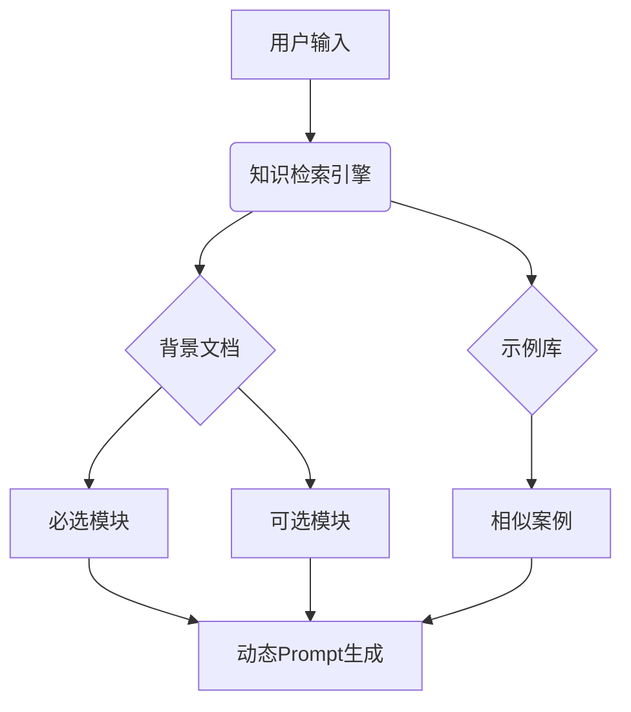

# Plant Simulation知识库系统设计方案

## 一、核心架构



## 二、详细设计说明

### 1. 背景文档管理
- **用途**：存储系统规则、接口规范、标准定义等核心约束条件
- **存储格式**：Markdown + JSON Schema
- **版本控制**：Git管理
- **更新机制**：
  - 自动校验新文档合规性
  - 语义化版本号(v1.0.0)

### 2. 知识检索流程
1. 解析用户输入语义
2. 提取关键词和上下文特征
3. 并行检索：
   - 背景文档：验证规则符合性
   - 示例库：匹配相似案例和术语转换
4. 综合评估返回Top 3相关结果

## 三、接口规范

### 1. 检索API
```python
def retrieve_knowledge(query: str, 
                      required: bool = True,
                      threshold: float = 0.7) -> List[Dict]:
    """
    query: 自然语言查询
    required: 是否只检索必选内容
    threshold: 相似度阈值
    """
```

### 2. 数据格式示例
```json
{
  "module": "core_rules",
  "content": "节点必须包含name和type字段...",
  "version": "1.2.0",
  "dependencies": ["time_formats"]
}