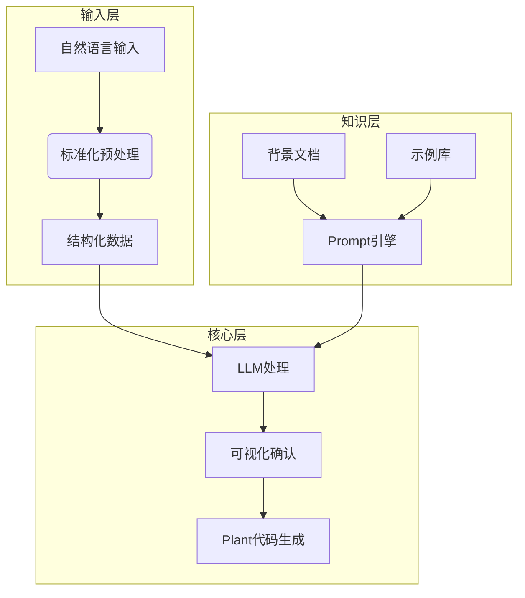
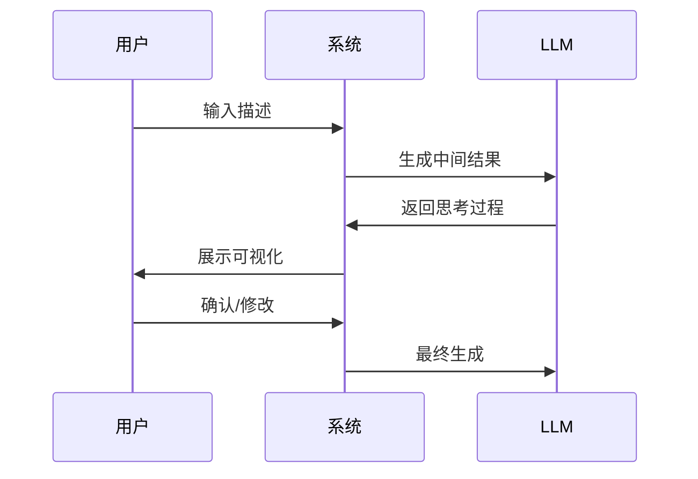

# Plant Simulation集成改进方案

## 一、总体架构设计


## 二、标准化输入处理
### 1. 处理流程
1. **术语映射**：建立领域术语对照表（如"加工站"→"工位"）
2. **单位统一**：自动转换时间单位（分钟→秒）和计量单位
3. **结构校验**：检查必填字段完整性

### 2. 模糊处理机制
- **检测类型**：
  - 缺失关键参数（如未指定处理时间）
  - 矛盾描述（如同时指定并行和串行）
  - 歧义表述（如"快速"、"大量"等定性描述）

### 3. 异常处理
- 生成结构化澄清问题
- 提供自动修正建议
- 支持用户手动修正
## 三、知识库检索与System Prompt生成
### 1. 知识库架构
- **必选模块**：核心规则、基础定义
- **可选模块**：行业规范、特殊场景
- **示例库**：典型场景案例及解决方案

### 2. 检索流程
1. 解析用户输入语义
2. 计算与知识库内容的相似度
3. 返回Top 3相关结果

### 3. System Prompt生成机制
- **基础模块**：角色定义+输出规范
- **动态组合**：根据场景添加行业模块
- **示例注入**：插入相似案例参考
## 四、有向图可视化与确认流程
### 1. 交互流程


### 2. 可视化功能
- **实时渲染**：NetworkX动态展示
- **节点编辑**：支持属性修改
- **版本对比**：不同版本差异可视化

### 3. 确认机制
- 中间结果确认
- 参数补充机制
- 最终模型锁定
## 五、关键代码实现
### 1. 输入标准化处理
```python
def standardize_input(text):
    # 术语替换
    for term in TERM_MAPPING:
        text = text.replace(term, TERM_MAPPING[term])
    # 模糊检测
    if detect_ambiguity(text):
        return generate_clarification(text)
    return text
```

### 2. 知识检索API
```python
def retrieve_knowledge(query: str, required: bool = True, threshold: float = 0.7):
    """返回Top 3相关结果"""
    results = []
    # 检索逻辑...
    return results[:3]
```

### 3. 可视化生成
```python
import networkx as nx
def visualize_graph(nodes):
    G = nx.DiGraph()
    for node in nodes:
        G.add_node(node['id'], **node['attrs'])
    # 绘制逻辑...
    return G
```